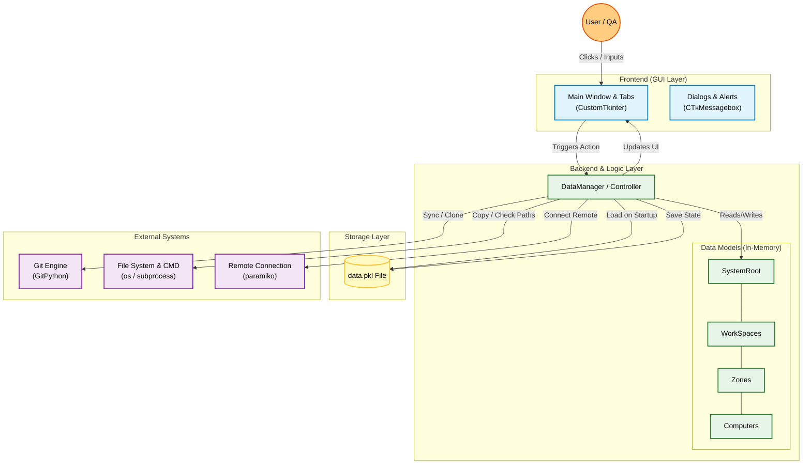
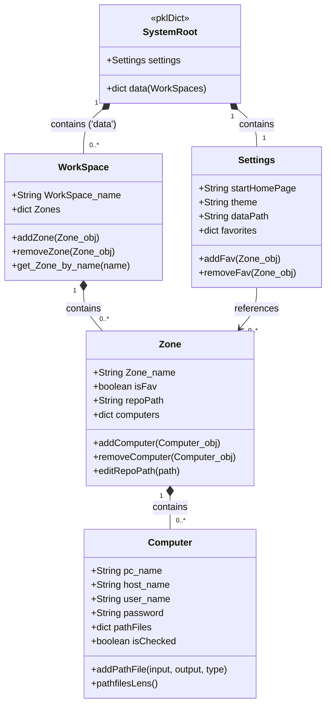

# Lab Sync 🔄

**A Desktop Dashboard for Git Automation and Lab Management**

---

## 📋 Overview
**Lab Sync** is a robust Python-based desktop application designed to streamline the management of multiple Git repositories across various workstations. It replaces complex command-line operations with a modern, user-friendly GUI.

The tool allows lab managers to monitor connection status, synchronize changes, and manage file systems across a hierarchical network of computers. It is specifically designed for testing environments like **QA Automation**, **Integration Labs**, and **Staging Environments**.

---

## ✨ Key Features
* **Visual Dashboard:** Real-time status indication for connected computers.
* **Git Automation:** One-click synchronization (Clone, Pull, Push) without using the CLI.
* **Hierarchical Management:** Organize computers by **Workspaces** and **Zones**.
* **Favorites Dashboard:** Pin frequently used zones for immediate access.
* **Global Quick Search:** Instantly locate any computer and navigate directly to its specific location using the top search bar.
* **Customizable Startup:** Configure your preferred default landing page to match your daily workflow.
* **Standalone Deployment:** Packaged as a portable `.exe` file using PyInstaller.
* **Persistence:** Automatic state saving using Python's `pickle` module.

---

## 🏗️ System Architecture
The application follows a modular architecture separating the Presentation Layer (GUI) from the Business Logic and Infrastructure.

---

## 🏛️ Data Model Architecture
The system uses a hierarchical data structure to organize lab resources. The **Settings** module manages global configurations and favorites, while the **Workspace** tree manages the physical entities.

---

## 🚀 How to Use

1.  **Create Structure:** Start by creating a `Workspace` (e.g., "Building A") and adding `Zones` (e.g., "QA Automation").
2.  **Add Computers:** Inside a zone, add computers by providing their IP/Hostname and credentials.
3.  **Search & Navigate:** Use the **Global Search** bar to instantly jump to any machine.
4.  **Sync:** Select a computer (or a whole zone) and click "Sync Git" to update repositories instantly.

## 🔮 Future Roadmap
- [ ] Add support for Linux/Mac remote machines.
- [ ] Implement SSH Key authentication management.
- [ ] Add "Dark/Light" mode toggle in real-time.
- [ ] Cloud backup integration.

---

## 📷 Gallery / Screenshots

| Zone Management | Settings & Favorites | Git Operations |
|:---:|:---:|:---:|
|  |  |  |
| *View and manage lab zones* | *Favorites & Startup Config* | *Live synchronization status* |

---
**Author:** [Your Name]
