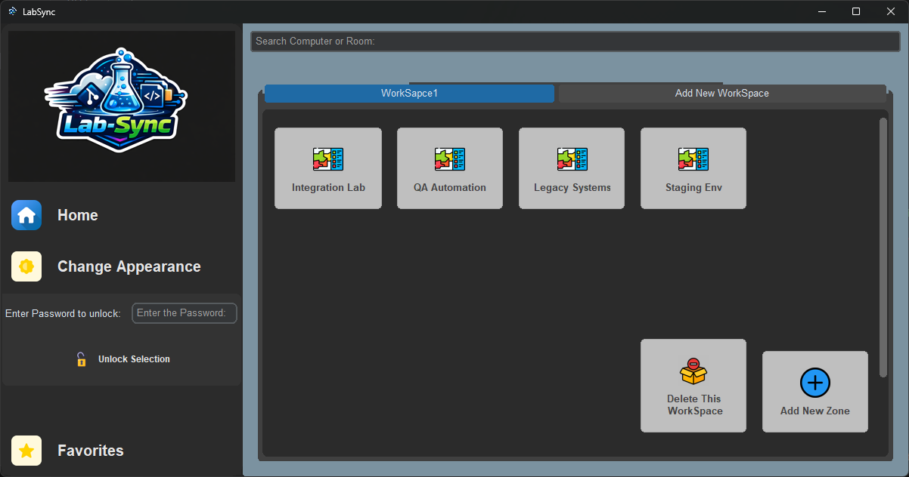
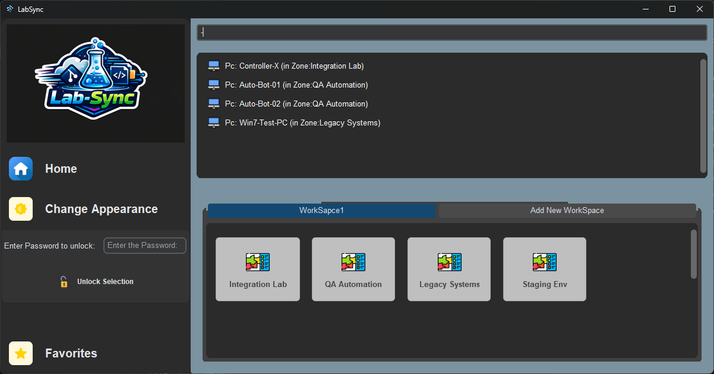
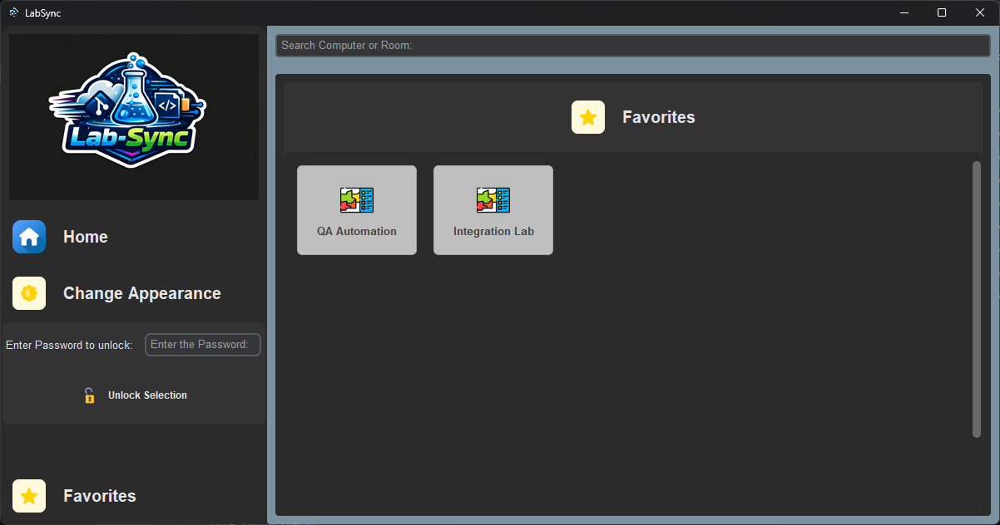

# Lab Sync 🔄


**A Desktop Dashboard for Git Automation and Lab Management**






---

## 📋 Overview
**Lab Sync** is a robust Python-based desktop application designed to streamline the management of multiple Git repositories across various workstations. It replaces complex command-line operations with a modern, user-friendly GUI.

The tool allows lab managers to monitor connection status, synchronize changes, and manage file systems across a hierarchical network of computers. It is specifically designed for testing environments like **QA Automation**, **Integration Labs**, and **Staging Environments**.

---

## ✨ Key Features
* **Visual Dashboard:** Real-time status indication for connected computers.
* **Git Automation:** One-click synchronization (Clone, Pull, Push) without using the CLI.
* **Hierarchical Management:** Organize computers by **Workspaces** and **Zones**.
* **Navigation Stack:** Browser-like "Back" and "Forward" navigation between screens.
* **Standalone Deployment:** Packaged as a portable `.exe` file using PyInstaller.
* **Persistence:** Automatic state saving using Python's `pickle` module.

---

## 🏗️ System Architecture
The application follows a modular architecture separating the Presentation Layer (GUI) from the Business Logic and Infrastructure.

```mermaid
graph TD
    %% Design Definitions
    classDef user fill:#ffcc80,stroke:#e65100,stroke-width:2px,color:black;
    classDef gui fill:#e1f5fe,stroke:#0277bd,stroke-width:2px,color:black;
    classDef logic fill:#e8f5e9,stroke:#2e7d32,stroke-width:2px,color:black;
    classDef external fill:#f3e5f5,stroke:#7b1fa2,stroke-width:2px,color:black;
    classDef storage fill:#fff9c4,stroke:#fbc02d,stroke-width:2px,color:black;

    %% Components
    User((User / QA)):::user

    subgraph Frontend ["Frontend (GUI Layer)"]
        UI["Main Window & Tabs<br>(CustomTkinter)"]:::gui
        Popups["Dialogs & Alerts<br>(CTkMessagebox)"]:::gui
    end

    subgraph Backend ["Backend & Logic Layer"]
        Manager["DataManager / Controller"]:::logic
        subgraph Models ["Data Models (In-Memory)"]
            Root[SystemRoot]:::logic
            WS[WorkSpaces]:::logic
            Zn[Zones]:::logic
            PC[Computers]:::logic
        end
    end

    subgraph Persistence ["Storage Layer"]
        PKL[("data.pkl File")]:::storage
    end

    subgraph Integrations ["External Systems"]
        Git["Git Engine<br>(GitPython)"]:::external
        OS["File System & CMD<br>(os / subprocess)"]:::external
        SSH["Remote Connection<br>(paramiko)"]:::external
    end

    %% Flow
    User -->|Clicks / Inputs| UI
    UI -->|Triggers Action| Manager
    Manager -->|Updates UI| UI
    Manager -->|Reads/Writes| Root
    Root --- WS --- Zn --- PC
    Manager -->|Load/Save| PKL
    Manager -->|Sync / Clone| Git
    Manager -->|Copy / Check Paths| OS
    Manager -->|Connect Remote| SSH
